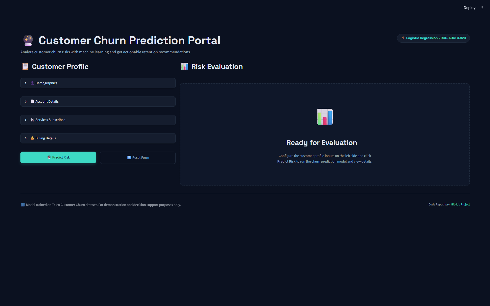

# Telco Customer Churn Prediction & Retention Dashboard

An end-to-end machine learning pipeline and interactive dashboard designed to predict customer churn, analyze risk factors using SHAP, and estimate the financial business impact of retention campaigns.

👉 **[Access the Live SaaS Dashboard](https://churn-prediction-k2rt7woncejrdwapmz8qmp.streamlit.app/)**

## Problem Statement
In the highly competitive telecommunications industry, retaining existing customers is far more cost-effective than acquiring new ones. Customer churn directly impacts monthly recurring revenue (MRR) and long-term business sustainability. The goal of this project is to build a predictive system that identifies customers at risk of leaving, provides explanations for individual churn risks, and translates these model predictions into quantifiable financial value for business stakeholders.

## Dataset
The project utilizes the [Kaggle Telco Customer Churn Dataset](https://www.kaggle.com/datasets/blastchar/telco-customer-churn), which contains profile and billing details for 7,043 customers of a fictional telecom company in California. Key features include demographics, contract specifications, monthly charges, and active services (e.g. Online Security, Tech Support, Streaming).

## Approach
The development pipeline is split into modular components:
1. **Exploratory Data Analysis (EDA)**: Visually exploring demographic distributions, correlation matrices, and churn triggers using a Jupyter Notebook.
2. **Data Preprocessing & Feature Engineering**: Converting raw customer profiles, managing missing values in `TotalCharges`, encoding categorical features using `LabelEncoder`, and engineering new features:
   - `NumServices`: Total active digital services (0-8)
   - `AvgMonthlySpend`: Average spending calculated from total charges and tenure
   - `IsNewCustomer`: A binary indicator flag for tenure <= 6 months
3. **Handling Class Imbalance**: Applying Synthetic Minority Over-sampling Technique (SMOTE) to the training set to prevent bias towards the majority class (non-churners).
4. **Model Evaluation & Selection**: Training and benchmarking Logistic Regression, Random Forest, and XGBoost classifiers.
5. **Model Explainability**: Utilizing SHAP (SHapley Additive exPlanations) values to extract global feature importances and interpret individual customer decisions.
6. **Deployment**: Delivering the solution via two channels:
   - An interactive, styled **Streamlit web application** for business users.
   - A high-performance **FastAPI REST API** for automated model serving.

## Results
Below is the evaluation summary of the models benchmarked on the hold-out test set (20% sample, stratified by the target label):

| Model | Precision | Recall | F1 | ROC-AUC |
| :--- | :--- | :--- | :--- | :--- |
| **Logistic Regression** | **0.5212** | **0.7219** | **0.6054** | **0.8289** |
| Random Forest | 0.5755 | 0.5909 | 0.5831 | 0.8224 |
| XGBoost | 0.5758 | 0.6096 | 0.5922 | 0.8168 |

* **Best Model**: **Logistic Regression** (ROC-AUC: **0.829**, Recall: **0.722**)
* **Discussion**: Logistic Regression outperformed the complex tree-based classifiers (Random Forest, XGBoost) in terms of overall ROC-AUC and Recall. For churn prediction, a high Recall (capturing 72.2% of actual churners) is highly desirable to ensure that most at-risk customers receive a retention offer. The simplicity of Logistic Regression also yields faster inference speeds and easier coefficients-based interpretability, making it the optimal choice for this dataset.

## Key Insights (SHAP Analysis)
Global explainability was evaluated using SHAP on the test set. The top 5 features influencing the model predictions are:

1. **NumServices (2.15)**: Customers with fewer bundled services are significantly more likely to churn, indicating that bundling multiple products acts as a strong customer lock-in mechanism.
2. **Contract (0.87)**: Month-to-month contracts are highly correlated with increased churn risk compared to stable 1-year or 2-year terms.
3. **tenure (0.81)**: Shorter tenure (new customers) represents a critical churn window, highlighting the need for intensive onboarding campaigns during the first 6 months.
4. **InternetService (0.74)**: Subscribing to Fiber Optic internet shows an unexpected positive impact on churn, suggesting potential pricing or service quality friction.
5. **OnlineSecurity (0.71)**: The absence of security add-ons decreases customer switching costs, making them more receptive to competitor offers.

## Business Impact
To bridge the gap between machine learning metrics and corporate finance, a business impact simulation was conducted on the hold-out test set of **1,409 customers**:

* **Target Population**: Out of 1,409 test customers, **374** actually churned.
* **Model Effectiveness**: The model successfully captured **270** of these churners (True Positives, representing a 72% Recall rate).
* **Retention Campaign Parameters**:
  - *Retention Success Rate*: **25%** (assumed percentage of targeted at-risk customers who accept an incentive offer and stay).
  - *Average Remaining Lifetime*: **12 months** (assumed duration the customer remains active after a successful intervention).
  - *Average Monthly Charges*: **$64.09**
* **Financial Projection**:
  $$\text{Protected Revenue} = \text{True Positives} \times \text{Success Rate} \times \text{Average Monthly Charge} \times 12$$
  The retention campaign is estimated to protect **$51,912** in annual recurring revenue on this 20% test sample alone. When scaled to the full customer database, this represents a significant financial recovery.

## Tech Stack
* **Languages**: Python
* **Data Processing**: Pandas, NumPy, Jupyter Notebook
* **Modeling & Metrics**: Scikit-Learn, XGBoost, Imbalanced-Learn (SMOTE)
* **Model Explanations**: SHAP
* **Serialization**: Joblib
* **Deployment & UI**: Streamlit, FastAPI, Uvicorn
* **Testing & Containerization**: Pytest, Docker

## Project Structure
```text
churn-prediction/
├── data/
│   ├── raw/                 # Original customer CSV dataset
│   └── processed/           # Split and preprocessed CSV datasets (train/test)
├── models/
│   ├── best_model.pkl       # Serialized best-performing model (Logistic Regression)
│   ├── encoders.pkl         # Dictionary of fitted LabelEncoder objects
│   ├── feature_names.pkl    # Serialized list of feature column names
│   ├── comparison.csv       # Benchmark metrics CSV output
│   ├── shap_feature_importance.png  # Average SHAP impact plot
│   └── shap_summary.png     # Detailed SHAP beeswarm plot
├── notebooks/
│   └── churn_exploration.ipynb  # Jupyter Notebook containing exploratory data analysis (EDA)
├── src/
│   ├── data_prep.py         # Data cleaning, feature engineering, and encoding
│   ├── train.py             # SMOTE balancing and model training pipeline
│   ├── explain.py           # SHAP visualization generation script
│   └── business_impact.py   # Business value calculations script
├── tests/
│   └── test_api.py          # Pytest unit tests for the FastAPI service endpoints
├── app.py                   # Streamlit SaaS dashboard
├── api.py                   # FastAPI REST API serving endpoints
├── Dockerfile               # Containerization configuration
└── README.md                # Project documentation
```

## How to Run

### 1. Installation
Clone the repository and install the dependencies:
```bash
pip install -r requirements.txt
```

### 2. Run the Data Pipeline
Execute the preprocessing script to clean the data, engineer new columns, and serialize label encoders:
```bash
python src/data_prep.py
```

### 3. Train Models
Run the training pipeline to balance the dataset with SMOTE, run model benchmarks, select the best model, and output the metrics report:
```bash
python src/train.py
```

### 4. Generate SHAP Explanations
Create the model explanation plots under the `models/` directory:
```bash
python src/explain.py
```

### 5. Calculate Business Value
Run the business simulation report on the test set:
```bash
python src/business_impact.py
```

### 6. Running Unit Tests
Validate the REST API endpoints and schema models using `pytest`:
```bash
pytest tests/
```

### 7. Run via Docker
Build and run the containerized FastAPI prediction service:
```bash
# Build the Docker image
docker build -t churn-prediction-api .

# Run the FastAPI server inside the container
docker run -p 8000:8000 churn-prediction-api
```

To run the Streamlit dashboard instead, override the container's starting command:
```bash
docker run -p 8501:8501 churn-prediction-api streamlit run app.py --server.port=8501 --server.address=0.0.0.0
```

### 8. Start Services Locally
* **Web Dashboard**: Launch the interactive Streamlit dashboard:
  ```bash
  streamlit run app.py
  ```
* **REST API**: Deploy the FastAPI prediction service locally:
  ```bash
  python api.py
  ```
  Access the interactive API docs at `http://127.0.0.1:8000/docs`.

## Live Demo & Deployment
Experience the interactive SaaS dashboard live:
👉 **[Access the Live Dashboard on Streamlit Cloud](https://churn-prediction-k2rt7woncejrdwapmz8qmp.streamlit.app/)**

### Local or Self-Hosted Deployment Guide:
You can also deploy the interactive Streamlit dashboard to **Hugging Face Spaces** or **Streamlit Community Cloud** for free.

#### Deploying to Hugging Face Spaces:
1. Create a free account at [Hugging Face](https://huggingface.co/).
2. Click **New Space** and configure:
   - **SDK**: Select `Streamlit`.
   - **Visibility**: Set to `Public` (or `Private`).
3. Commit and push the following files to your space repository:
   - `app.py`
   - `requirements.txt`
   - `models/best_model.pkl`
   - `models/encoders.pkl`
   - `models/feature_names.pkl`
4. The space will automatically install dependencies and run your Streamlit SaaS dashboard in a live environment!



## Future Improvements
* **Hyperparameter Tuning**: Implement automated search (GridSearchCV or Optuna) to optimize Random Forest and XGBoost hyperparameters.
* **CI/CD Integration**: Add automated testing and formatting workflows using GitHub Actions.
